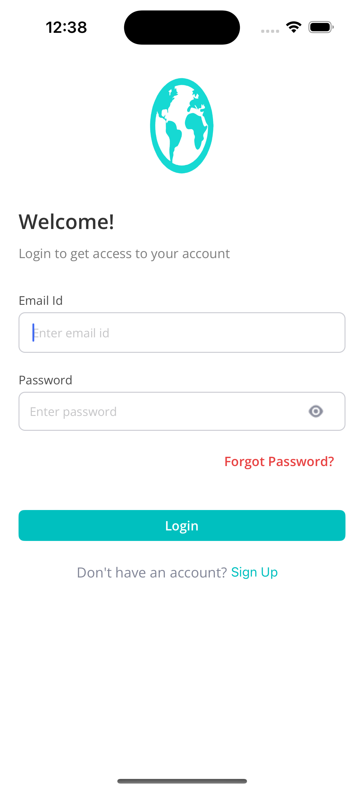
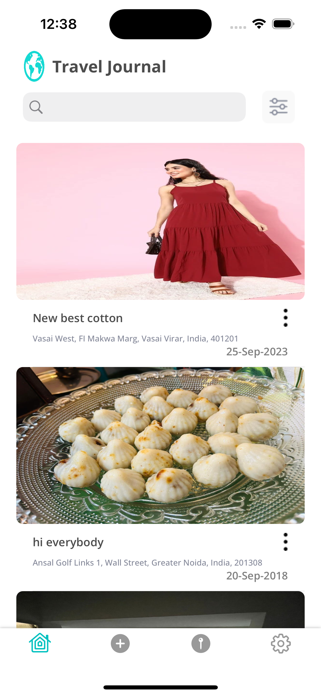
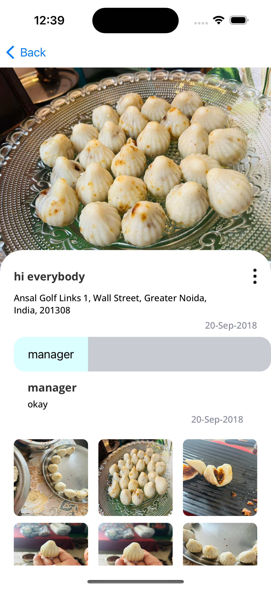
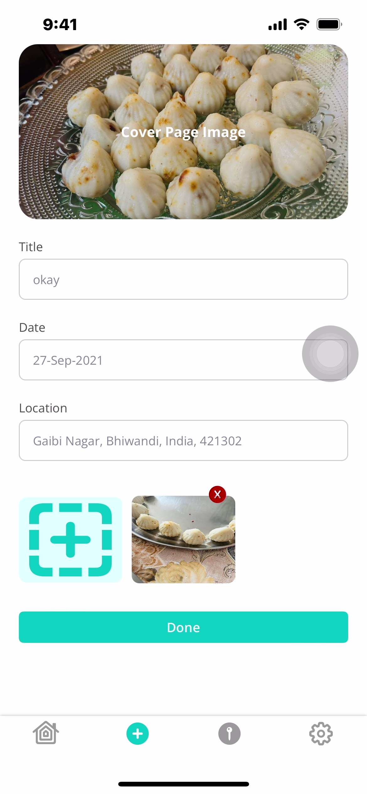
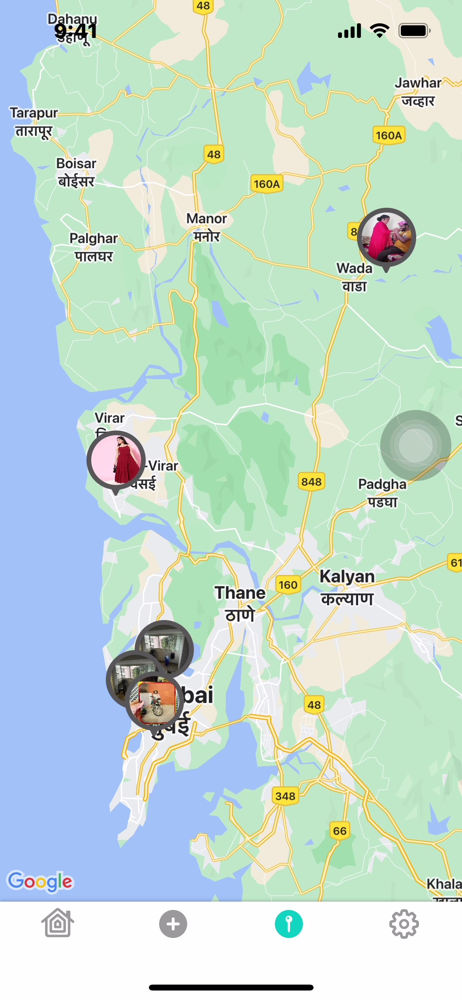
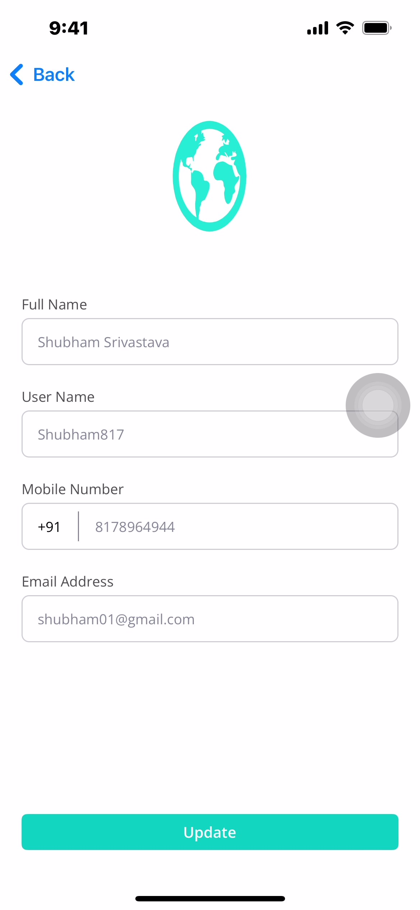

# Travel Journal App

The Travel Journal app allows users to document their travel experiences by creating digital journals for each trip they take. Users can record their memories, add photos, and keep track of places they visited during their trips. The app should provide a user-friendly interface to manage multiple travel journals and organize them effectively.

## Key Features:

User Authentication: Implement user registration and login functionality using Firebase Authentication to allow users to create and access their travel journals.

Create a New Travel Journal: Enable users to create a new journal for each trip they embark on. They can provide a title, date, location, and a cover photo for the journal.
Add Journal Entries: Allow users to create journal entries for each day or significant event during their trip. Each entry should have a title, date, text content, and the option to attach photos.

Geotagging: Integrate location services to automatically record the location of each journal entry. Users can view their travel route on the map based on the entries' geotags.

View and Edit Journals: Users should be able to view all their travel journals as a list or on a map. They can edit or delete entries and update journal details.

Search and Filters: Implement search functionality to allow users to search for specific journals or entries. Also, provide filters to sort journals based on date, location, or title.

User Profile: Create a user profile section where users can manage their account settings, update profile information, and view their travel statistics (e.g., total trips taken, countries visited, etc.).

## App Images

### Login Screen

### Home Screen

### Post Details Screen

### Add Post Screen

### Map View

### Profile Screen

